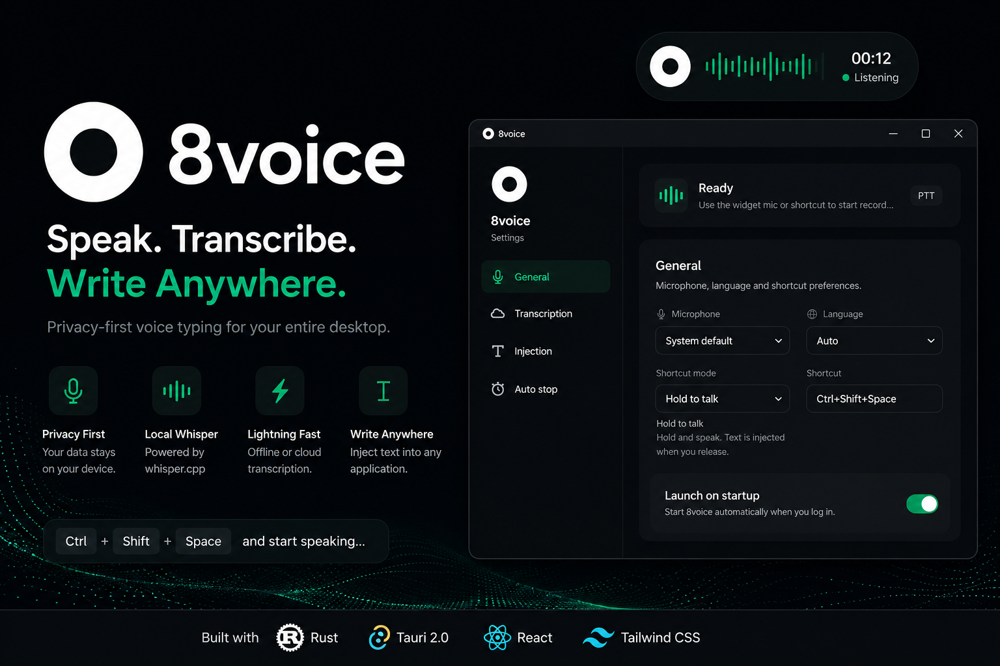

<p align="center">
  
</p>

<h1 align="center">8voice</h1>

<p align="center">
  A privacy-first voice dictation app. Press a global shortcut, speak, and 8voice transcribes your speech into text — directly into any application.
</p>

## Features

- **Global shortcut** — push-to-talk or toggle mode (default: `Ctrl+Q`)
- **Floating widget** — draggable, always-on-top pill for one-click recording with live waveform
- **Offline transcription** — local Whisper GGUF models via whisper.cpp
- **Cloud transcription** — Groq Whisper, Deepgram Nova-2, AssemblyAI Universal-2
- **Multiple ASR backends** — built-in model downloader for Whisper GGUF from HuggingFace
- **Voice Activity Detection (VAD)** — configurable silence timeout for auto-stop
- **Text injection** — auto-inject, type, or paste into the active window
- **99 Whisper languages** — from Afrikaans to Zulu, plus auto-detect
- **Onboarding wizard** — step-by-step first-run setup (6 steps)
- **Auto-updater** — signed updates via GitHub Releases
- **System tray** — lives in the tray when the window is closed
- **Launch on startup** — optional autostart

## Tech Stack

| Layer | Choice |
| --- | --- |
| App shell | Tauri 2.0 (Rust + Web UI) |
| UI | React 19 + TypeScript + Tailwind CSS v4 |
| Audio capture | cpal + rubato (16 kHz mono resampling) |
| Offline transcription | whisper-rs (whisper.cpp, GGUF) |
| Cloud transcription | Groq Whisper API, Deepgram Nova-2, AssemblyAI Universal-2 |
| VAD | WebRTC VAD |
| Text injection | enigo (typing) + arboard (clipboard paste) |
| Global shortcut | tauri-plugin-global-shortcut |
| Settings | tauri-plugin-store (JSON) |
| Signing | Ed25519 (passwordless key) |

## Prerequisites

- [Rust](https://rustup.rs) (stable ≥ 1.75)
- [Node.js](https://nodejs.org) ≥ 20 LTS
- [Tauri 2 prerequisites](https://v2.tauri.app/start/prerequisites/)
  - Windows: WebView2 + MSVC build tools
  - macOS: Xcode Command Line Tools + `brew install create-dmg`
  - Linux: webkit2gtk-4.1-dev, libayatana-appindicator3-dev, librsvg2-dev, patchelf
- C/C++ toolchain (required for whisper.cpp native compilation)

## Installation

### Pre-built binaries

Download the latest release for your platform from the [Releases](https://github.com/alparlsan88/8voice/releases) page:

- **Windows**: `.msi` installer
- **macOS**: `.dmg` (universal — Intel + Apple Silicon)
- **Linux**: `.AppImage` or `.deb`

### Build from source

```bash
# Clone the repository
git clone https://github.com/alparlsan88/8voice.git
cd 8voice

# Install frontend dependencies
npm install

# Production build (creates platform installers)
npm run tauri build
```

The app bundles Whisper.cpp internally. On first launch you can download a model from within the app, or manually place a GGUF file in `src-tauri/models/`. Models are available at [huggingface.co/ggerganov/whisper.cpp](https://huggingface.co/ggerganov/whisper.cpp).

## Running

```bash
# Development (hot reload + Rust rebuild)
npm run tauri dev

# Production build
npm run tauri build
```

On first launch the **onboarding wizard** will guide you through setting up your transcription provider, microphone, language, shortcut, and injection mode.

## Usage

### Quick start

1. Open 8voice — it starts in the system tray.
2. Press your configured shortcut (default: `Ctrl+Q`) to start recording.
3. Speak — the floating widget shows live audio feedback.
4. Press the shortcut again (toggle mode) or release (push-to-talk) to stop.
5. The transcribed text is injected into your focused application.

### Cloud API keys

To use cloud transcription providers, obtain an API key:

| Provider | Get API Key | Free Tier |
| --- | --- | --- |
| Groq | [console.groq.com/keys](https://console.groq.com/keys) | Rate-limited free tier |
| Deepgram | [console.deepgram.com](https://console.deepgram.com) | $200 free credit |
| AssemblyAI | [assemblyai.com](https://www.assemblyai.com) | 100 hours free |

## Multi-Language Support

8voice supports 99 Whisper languages. Set your preferred language in Settings or during onboarding. When set to **Auto**, the system detects the language automatically.

## Project Structure

```
src-tauri/src/           # Rust backend
├── main.rs              # Binary entry point
├── lib.rs               # Tauri bootstrap, tray, plugins, commands, pipeline
├── audio.rs             # cpal capture + rubato resample + ring buffer
├── transcribe.rs        # whisper.cpp + Groq + Deepgram + AssemblyAI
├── inject.rs            # enigo typing + arboard clipboard paste
├── hotkey.rs            # global shortcut registration
├── state.rs             # recording state machine
├── settings.rs          # JSON settings via tauri-plugin-store
├── tray.rs              # system tray icon + menu
├── vad.rs               # WebRTC voice activity detection
├── onboarding.rs        # model download controller + whisper model listing
├── vosk_engine.rs       # Vosk offline engine (stub — manual DLL install)
└── sherpa_engine.rs     # Sherpa-ONNX offline engine (stub — native linking)
```

```
src/                     # React + TypeScript frontend
├── main.tsx             # App entry point
├── App.tsx              # Main settings UI (General, Transcription, Injection, Auto-stop tabs)
├── Onboarding.tsx       # 6-step first-run setup wizard
├── types.ts             # Shared TypeScript types (Settings, ApiProvider, etc.)
├── languages.ts         # 99 Whisper language codes + auto
├── widget/
│   ├── main.tsx         # Widget entry point
│   └── Widget.tsx       # Floating mic widget with live waveform
└── assets/
    └── ...              # Static assets
```

## Platform Notes

| Platform | Note |
| --- | --- |
| Windows | Microphone access is enabled by default. Widget uses DWM for transparent rounded corners. |
| macOS | Accessibility permission required (System Settings → Privacy & Security → Accessibility). Whisper.cpp can use Metal GPU acceleration. |
| Linux | X11 works best; Wayland text injection falls back to clipboard. |

## Offline Engine Notes

| Engine | Bundled | Status |
| --- | --- | --- |
| Whisper (whisper.cpp) | ✅ Bundled | Ready — GGUF models downloaded from HuggingFace |
| Vosk | ❌ Manual | Stub — requires manual `vosk-api.dll` installation |
| Sherpa-ONNX | ❌ Manual | Stub — `/MT` vs `/MD` CRT conflict; requires native lib linking |

## Contributing

See [CONTRIBUTING.md](./CONTRIBUTING.md).

## Security

See [SECURITY.md](./SECURITY.md).

## License

[MIT](./LICENSE) © 2026 8voice
